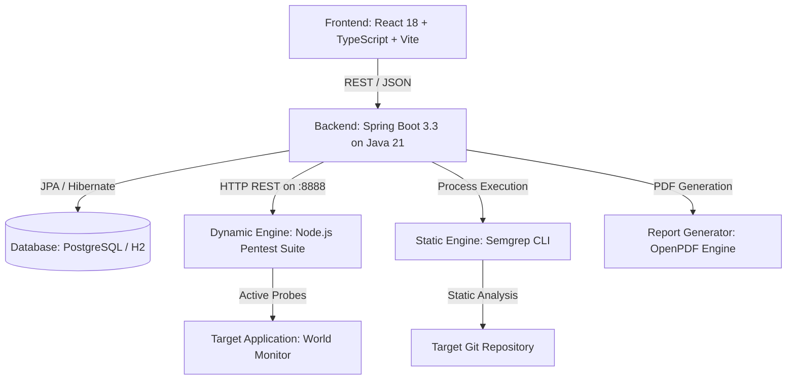

# 🛡️ WorldGuard — Security Assessment Platform

**Smart India Hackathon 2026** · Problem Statement **SIH26163**

A vulnerability scanner, threat-correlation engine and security-posture auditor built for the
[World Monitor](https://worldmonitor.app) intelligence platform. It runs three kinds of analysis
against code you are authorised to test, and produces a PDF report a developer can act on.

---

## 🛠️ Technology Stack & Architecture

WorldGuard is architected as a distributed security assessment platform comprising a reactive frontend dashboard, a Spring Boot orchestration backend, dual security analysis engines (SAST & DAST), and an automated report generation pipeline.

### Component Breakdown

| Layer | Technology | Version | Purpose / Responsibilities |
|---|---|---|---|
| **Frontend** | React | 18.3.1 | Reactive, component-based user interface |
| | TypeScript | 5.4.5 | Strict static typing and interface contracts |
| | Vite | 5.3.1 | Next-generation frontend build tooling and fast HMR |
| | Vanilla CSS | Modern CSS3 | Custom design system, dark-mode tokens, glassmorphism, responsive layout |
| | Lucide React | 0.395.0 | Consistent security and status icon set |
| **Backend API** | Java | 21 (LTS) | Core programming language runtime |
| | Spring Boot | 3.3.3 | REST API services, lifecycle management, and dependency injection |
| | Spring Data JPA | 3.3.3 | Entity-relational mapping and database abstraction |
| | Hibernate Validator | Jakarta | Request validation and target safety enforcement |
| **Database** | PostgreSQL | 15+ (Default) | Production-grade relational persistence for scans, findings, and metrics |
| | H2 Database | 2.x (In-memory) | Embedded zero-setup profile for instant evaluation (`SPRING_PROFILES_ACTIVE=h2`) |
| **Dynamic Scanner (DAST)** | Node.js | 18+ | Lightweight high-performance microservice engine (`pentest-suite`) |
| | ES Modules | Native | Asynchronous crawler, active probe injection, SSRF & header analysis |
| **Static Scanner (SAST)** | Semgrep CLI | Latest | Semantic pattern-matching engine against source code |
| | Custom Rule Pack | YAML | Tailored detection rules for World Monitor vulnerabilities |
| **Reporting Engine** | OpenPDF | 1.3.39 | Audit-grade vector PDF report generation with prioritized fix lists |
| **Security Standards** | CVSS v3.1 | — | Industry-standard Common Vulnerability Scoring System base metrics |
| | OWASP Top 10 | 2021 | Web application security risk categorization |
| | CWE | — | Common Weakness Enumeration taxonomy |

### Architecture Overview



---

## Project layout

```
SIH World monitor/
├── backend/                          # Spring Boot API
│   └── src/main/java/com/sih/securityplatform/
│       ├── controller/               # REST endpoints
│       ├── model/                    # JPA entities (Scan, Finding, enums)
│       ├── repository/               # Spring Data repositories
│       ├── dto/                      # request/response shapes
│       └── service/                  # orchestration, scoring, reporting, analysis
│           └── pentest/              # client for the external dynamic engine
│
├── frontend/                         # React + TypeScript UI
│   └── src/
│       ├── components/               # Navbar, FindingCard, FindingModal, SecurityGauge
│       ├── pages/                    # Dashboard, NewScan, ScanDetail, Findings, Reports, ApiTester
│       └── services/api.ts           # typed API client
│
├── scanner/
│   ├── static-test/
│   │   └── semgrep/                  # curated Semgrep rule pack
│   └── dynamic-test/
│       ├── pentest-suite/            # Node.js scanning engine (port 8888)
│       └── api/                      # API probe specifications
│
└── scripts/                          # one-click startup helpers
```

---

## Running it

**Requirements:** Java 21+, Maven 3.9+, Node 18+.

```cmd
scripts\start-all.bat
```

That starts three processes:

| Service | URL |
|---|---|
| Web UI | http://localhost:5173 |
| Backend API | http://localhost:8080 |
| Dynamic engine | http://localhost:8888 |

### Database

PostgreSQL is the default:

```sql
CREATE DATABASE wm_security;
```

Prefer no database at all? Use the embedded profile:

```cmd
set SPRING_PROFILES_ACTIVE=h2
scripts\start-all.bat
```

### Running the parts separately

```bash
cd backend   && mvn spring-boot:run
cd frontend  && npm install && npm run dev
cd scanner/dynamic-test/pentest-suite && node server.mjs
```

---

## Scan types

| Type | What it does | Est. (STANDARD) |
|---|---|---|
| **Complete** | Static source + dynamic pentest + API probe, merged into one report | ~5 min |
| **Dynamic (DAST)** | Crawls and actively probes a running site | ~6 min |
| **Static (SAST)** | Clones `github.com/koala73/worldmonitor` and analyses the source | ~5 min |
| **API probe** | Headers, CORS, info disclosure and method handling on one endpoint | ~25 s |

### Durations are measured, not guessed

The time shown in the UI comes from the backend. It starts from realistic defaults and is
**replaced by the actual measured duration** after each run, with headroom added so the promise
is never optimistic.

A scan is also **guaranteed to finish**: every phase has a deadline, and when a scan reaches its
budget it finalises with whatever it has collected and records why. A scan is never left
`RUNNING`, and partial results are labelled as such rather than thrown away.

---

## How results are produced

1. **Acquire** — clone the repository, or point the crawler at a running target.
2. **Analyse** — Semgrep and the built-in rule set for code; the Pentest Suite for runtime
   behaviour; a focused probe for a single endpoint.
3. **Normalise** — every finding is mapped onto one model with a CVSS score, CWE and OWASP tag.
4. **Deduplicate** — a stable SHA-256 fingerprint collapses the same issue reported twice.
5. **Correlate** — related findings on the same endpoint are linked.
6. **Verify** — findings are graded by evidence. Confirmed issues stay confirmed; unconfirmed
   static pattern matches stay `Potential`.
7. **Score** — a 0–100 posture score weighted by severity *and* confidence, so a noisy rule set
   cannot make a target look worse than it is.
8. **Report** — a PDF with a verdict, a prioritised fix list, and per-issue evidence.

### What the confidence labels mean

| Label | Meaning |
|---|---|
| **Verified** | Observed directly at runtime with supporting evidence |
| **Needs review** | Runtime signal without conclusive proof |
| **Potential** | Static pattern match; reachable or exploitable is unproven |

---

## The report

The PDF is written for a developer who has to fix the problems:

1. **Score and verdict** — the number, its band, and a one-line judgement.
2. **Summary** — what was scanned, how long it took, what was confirmed.
3. **Prioritised fix list** — every issue ranked by severity then confidence, with the file and
   line to change and an effort estimate.
4. **Issue details** — what is wrong, why it matters, the evidence, how to reproduce, and the fix.
5. **Coverage and limitations** — what the engines could and could not see, so a partial result
   is never mistaken for a clean bill of health.

---

## Safety

- Every scan requires an explicit authorisation confirmation.
- Targets are validated before any request is sent: cloud metadata endpoints are blocked, DNS
  results are checked against private ranges, and only `http`/`https` are permitted.
- All testing is non-destructive.

---

## Tests

```bash
cd backend && mvn test     # 36 tests
cd frontend && npm run build
```

The suite covers score calibration, duration/deadline guarantees, filter correctness, the target
security policy, and the database migration that repairs legacy rows on startup.

---

## Licence

Developed for the Smart India Hackathon 2026 under problem statement SIH26163.
Target application: [World Monitor](https://github.com/koala73/worldmonitor).
